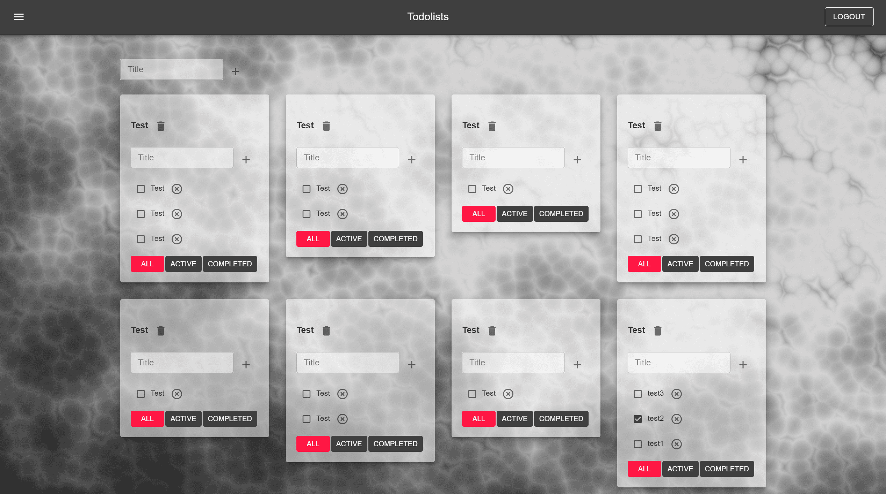
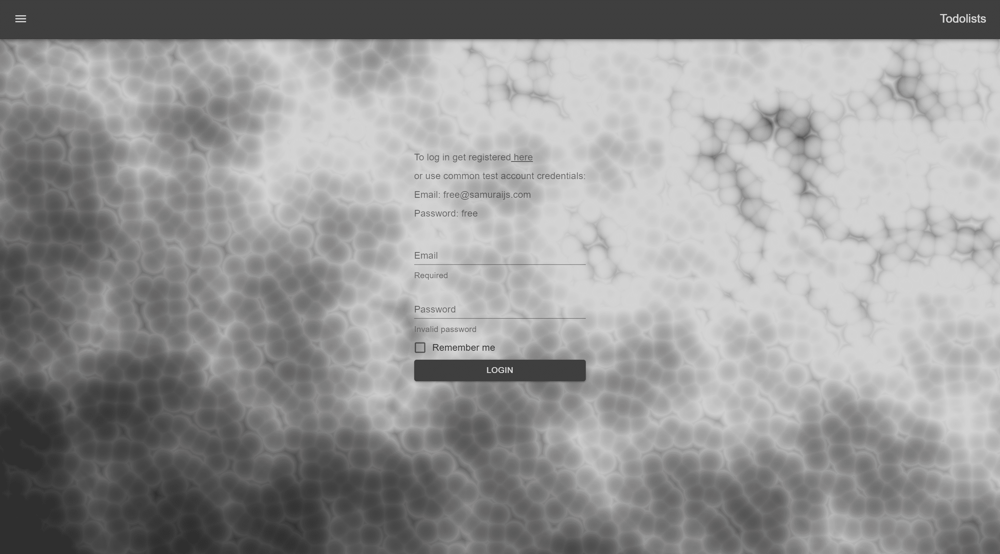

# Todolist 
___

## Description

This app is a todolist simulator. 
You can set global tasks and break them down into smaller subtasks. 
Todolist project made on functional components using hooks.  
Demo: https://nazaruk-d.github.io/ToDoList  

Application functionality:  
+ Loginization  
+ Adding / removal a new task  
+ Adding / removal a subtask  
+ change the name of the task / subtask  
+ set value - done for subtask  
+ filter subtasks  

___

### :briefcase: language and tools

 
 

[//]: # (___)

## Loginization

For testing, you can use a special account:  
Login - <b>free@samuraijs.com</b> 
Password - <b>free</b>   

The following libraries are installed in this project:

- **material-ui**

- **axios**

- **classnames**

- **formik**

- **gh-pages**

- **jest**

- **react** and **@types/react**

- **react-dom** and **@types/react-dom**

- **react-redux** and **@types/react-redux**

- **react-router-dom** and **@types/react-router-dom**

- **react-scripts**

- **react-test-renderer** and **@types/react-test-renderer**

- **redux**

- **redux-form** and **@types/redux-form**

- **redux-thunk**

- **reselect**

- **typescript**

- **uuid** and **@types/uuid**
- **sass**
- **vanta**

## How to start a project

After git clone 'link' install all dependencies from package.json:

### `yarn`

and then run the project:

### `yarn start`

